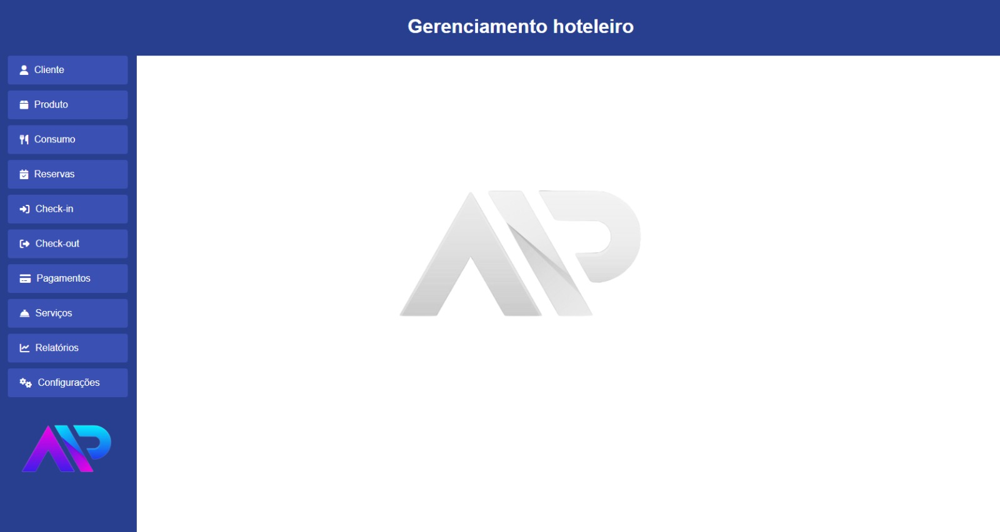

# Sistema Hoteleiro
***

O projeto de sistema hoteleiro atualmente se concentra nas operações básicas de CRUD. Essas funcionalidades são essenciais para manter dados atualizados e organizados. Fases futuras planejam a integração de recursos adicionais, como pagamentos online e relatórios.
***
# Ajustes e melhorias
O projeto ainda está em desenvolvimento o que esperamos para as proximas etapas:

- [x] Amadurecimento da ideia
- [x] Pesquisa de mercado
- [x] Desenvolvimento básico
- [ ] Design e usabilidade
- [ ] Desenvolvimento de funcionalidades mais avançadas
***
# Quem esta desenvolvendo o projeto 👨‍💻👩‍💻

Linkedin : 
[Ana Julia Calaça](www.linkedin.com/in/ana-julia-felipe-araujo-calaça-27735627a)

Linkedin :
[Pedro Henrique Bernardes](https://www.linkedin.com/in/pedro-henrique-pinheiro-bernardes-860a92295?utm_source=share&utm_campaign=share_via&utm_content=profile&utm_medium=android_app)

